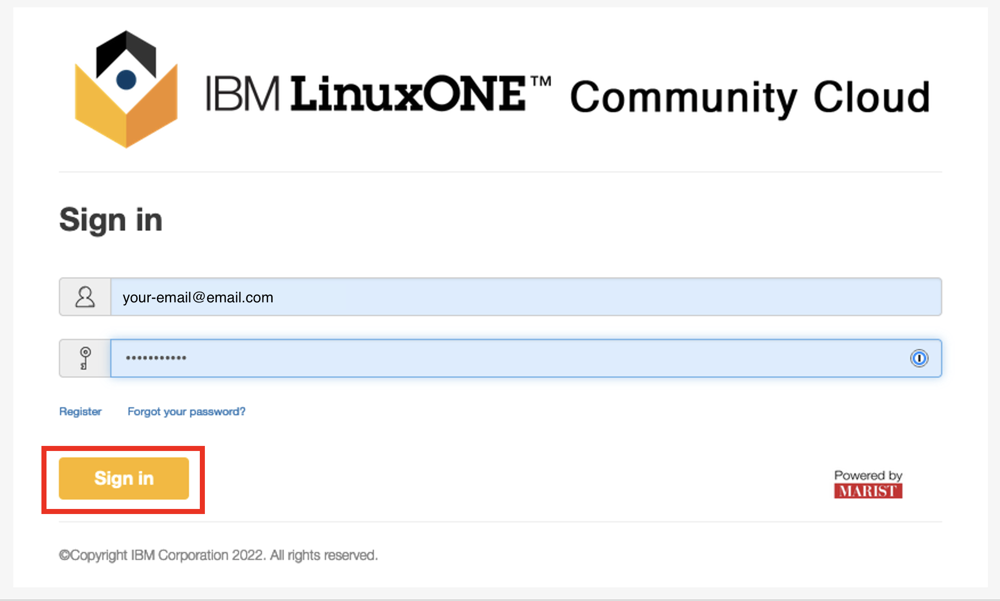
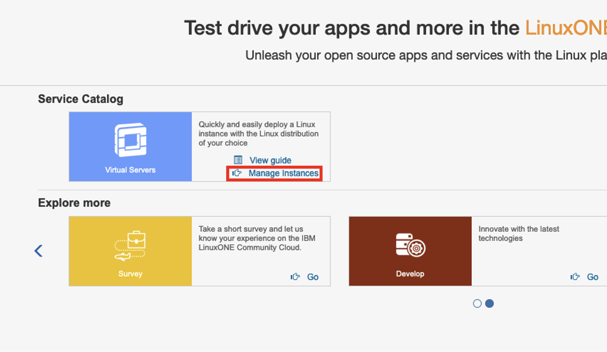
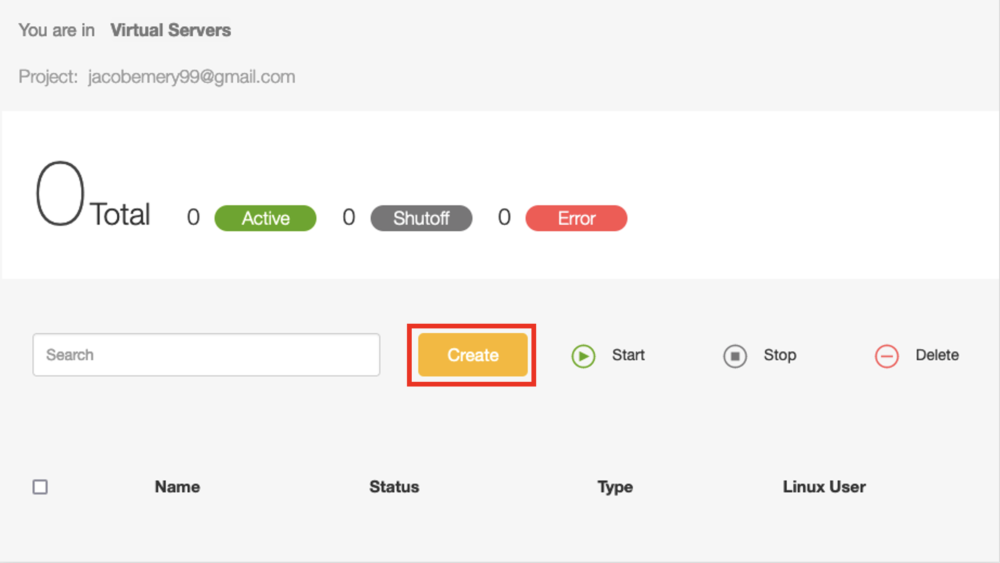
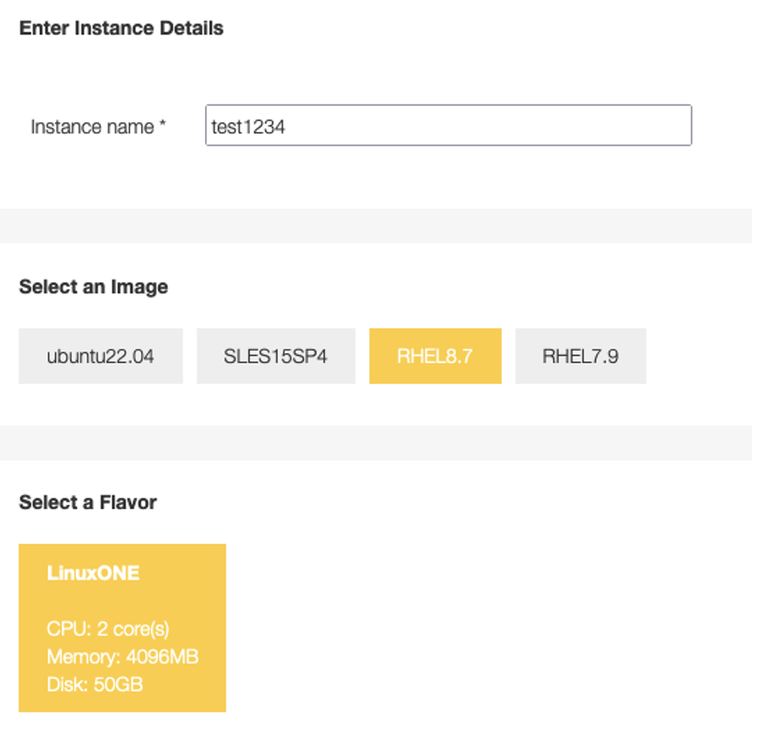
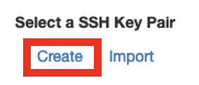
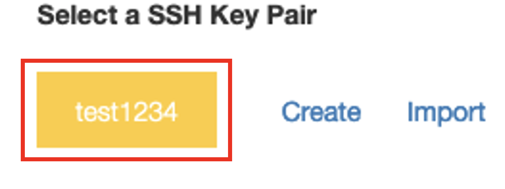

# Provisioning your IBM LinuxONE Virtual Server
## Follow these steps to setup your IBM LinuxONE virtual server for the first time.
* If you have not yet registered for an account, return to [step 1](./1_register.md) for instructions. 
* If you have already provisioned your virtual server, choose the correct step 3 instructions page based on whether you are using either [Windows](./3_windows_connect.md) or [Mac](./3_mac_connect.md).

1) Sign in to the [IBM LinuxONE Community Cloud website](https://linuxone.cloud.marist.edu/#/login) using Firefox or Google Chrome: 

2) Click on the `Manage Instances` link on the following page, under 'Service Catalog':

3) Click on `Create` on the following page:

4) Select options for your virtual server:
* <b>Instance name</b>: can be anything of your choosing, i.e. test1234
* <b>Select an Image</b>: `RHEL8.7` - Red Hat Enterprise Linux version 8.7
* <b>Select a Flavor</b>: `LinuxONE` - the only option available.

4) Click `Create` under 'Select a SSH key pair':

 

5) Type in a name for your key pair (it can be anything) and click `Create a new key pair`:

 

6) Click on the button of your newly created key pair to select it:

7) Click the `Create` button at the bottom right of the page.

8) Wait for the server to instantiate. This may take up a few minutes... \
Don't be alarmed when the 'Status' of the virtual server is `UNKNOWN`. After some time it will change to `spawning` and then `ACTIVE` - which means it is now ready!

## You are now ready to connect to the server. Choose the correct step 3 instructions page based on whether you are using [Windows](./3_windows_connect.md) or [Mac](./3_mac_connect.md).
