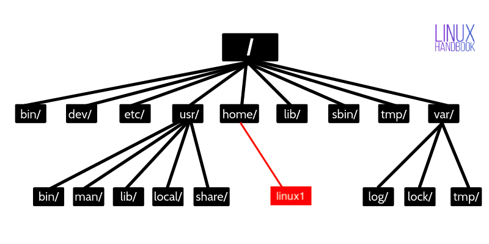

# Navigating the Linux Terminal
## Welcome to the Server! Follow these steps to learn the basics of how to navigate the Linux terminal.
* If you are not yet connected to your virtual server via SSH, see step 3 [Windows](./3_windows_connect_to_server.md) or [Mac](./3_mac_connect.md).
* If you are already comfortable with navigating the Linux terminal, you can skip to [step 5](./5_services.md).

You should be looking at the following text in either PuTTY or Terminal:
```
 ___ ____  __  __      _     _                   ___  _   _ _____
|_ _| __ )|  \/  |    | |   (_)_ __  _   ___  __/ _ \| \ | | ____|
 | ||  _ \| |\/| |    | |   | | '_ \| | | \ \/ / | | |  \| |  _|
 | || |_) | |  | |    | |___| | | | | |_| |>  <| |_| | |\  | |___
|___|____/|_|  |_|    |_____|_|_| |_|\__,_/_/\_\\___/|_| \_|_____|

=================================================================================
Welcome to the IBM LinuxONE Community Cloud!

This server is for authorized users only. All activity is logged and monitored.
Individuals using this server must abide to the Terms and Conditions listed here:
https://www.ibm.com/community/z/ibm-linuxone-community-cloud-terms-and-conditions/
Your access will be revoked for any non-compliance.
==================================================================================
Last login: Sat Feb 11 17:09:01 2023 from 76.172.75.216
[linux1@test1234 ~]$
```
* This is the terminal prompt welcoming you to the server!
* At the bottom of the welcome text, you will see something like this: 
```
[linux1@test1234 ~]$
```
* This indicates that you are connected to the server `test1234` as the user `linux1` in the home directory (or folder) `~`, and that you are a regular user `$`.
* Makes sense so far?
## Get Your Bearings
* Where are you? 
* In a headless (non-graphical) environment like this one, it can be tough to understand where you are!
* It's as if you are living inside the 'File Explorer' on Windows or 'Finder' on Mac, which can be daunting!
* Well, as we saw in the terminal prompt, you're in your home (`~`), but where is that exactly? To see which folder you're currently in, use the `pwd` (short for 'print working directory') command:
```
pwd
```
Which returns:
```
/home/linux1
```
* Meaning, from the root directory `/`, you are in the `home` directory and then the `linux1` sub-directory. 
Here's a diagram to help you out:


* To read more about the Linux directory structure, click [here](https://linuxhandbook.com/linux-directory-structure/).
* Next, what are the contents of this directory you're in? Use the `ls` command to list the contents of a directory:
```
ls
```
* Well that wasn't very exciting was it?
* It appears there's nothing in your home directory...
* But wait! Let's try that same command with the `l` and `a` options for 'list' and 'all'.
```
ls -la
```
```
total 28
drwx------  3 linux1 linux1 4096 Feb 11 17:09 .
drwxr-xr-x. 4 root   root   4096 Jun 21  2021 ..
-rw-------  1 linux1 linux1   17 Feb 11 17:09 .bash_history
-rw-r--r--  1 linux1 linux1   18 Aug 30  2019 .bash_logout
-rw-r--r--  1 linux1 linux1  141 Aug 30  2019 .bash_profile
-rw-r--r--  1 linux1 linux1  312 Aug 30  2019 .bashrc
drwx------  2 linux1 linux1 4096 Dec 11 22:08 .ssh
```
* How sneaky! The files listed here (i.e. `.bash_profile` on the right-hand column) are hidden. 
* Any file that starts with a period `.` will be hidden.
* This listing tells us some interesting information about the files.
* For example, in the left-hand column you'll see things like the permissions `drwx------` in the row for the `.ssh` file. These letters tell us who has access to each file. 
* This tells us that the `.ssh` file is actually a directory (or folder), as indicated by the `d` in its permissions bits.
* And the other bits (`rwx`) tell us that the owner (you) has read, write and execute permissions. And that no one else has access to this folder (`------`), which is a good thing since SSH information is how you login and should be kept secret!
* Read more about Linux file permissions [here](https://www.linuxfoundation.org/blog/blog/classic-sysadmin-understanding-linux-file-permissions).
* Let's see what's in the `.ssh` directory, shall we? 
* Do an `ls -la` on the .ssh directory:
```
ls -la .ssh
```
```
total 12
drwx------ 2 linux1 linux1 4096 Dec 11 22:08 .
drwx------ 3 linux1 linux1 4096 Feb 11 17:09 ..
-rw------- 1 linux1 linux1  399 Feb 11 14:56 authorized_keys
```
* Looks like there's a file in there called `authorized_keys`.
* This file stores the public cryptographic keys that are authorized to connect to the server as the `linux1` user.
* Yours should be in there! Let's double check. 
* To quickly display the contents of a file, use the `cat` (short for 'concatenate') command:
```
cat .ssh/authorized_keys
```
* Which will return a long string of numbers and letters, which represent the public key you used to connect to the server.
```
ssh-rsa AAAA[...]ISz1L Generated-by-Nova
```
* At this point, you probably have a pretty cluttered terminal screen.
* Use the `clear` command:
```
clear
```
* Much better!
## Navigate the Directory Structure
* Well, now that you've got our bearings about where you are, you may be asking, how do you move around?
* Use the `cd` command to 'change directories'.
```
cd .ssh
```
* You are now in the `.ssh` directory. From here you can see the `authorized_keys` file with ls without having to specify the directory.
```
ls -la
```
```
total 12
drwx------ 2 linux1 linux1 4096 Dec 11 22:08 .
drwx------ 3 linux1 linux1 4096 Feb 11 17:09 ..
-rw------- 1 linux1 linux1  399 Feb 11 14:56 authorized_keys
```
* And how do we go back?
* You may have noticed the `.` and `..` directories in the output of the `ls -la` command.
* `.` represents the current directory, and `..` represents the directory one level above this one.
* Change back to your home directory now:
```
cd ..
```
* The home directory, as we found out earlier, also has a special symbol of its own: `~`
* If you ever get lost, you can always return home like this:
```
cd ~
```
* Safe and sound!

## Let's Review
You've been introduced to quite a few commands already:
* `pwd` to see which directory you are in currently
* `ls <directory>` to see what's in a directory
* `cat <file>` to see what's in a file
* `clear` to clear the screen
* `cd <directory>` to change directories

## You are now ready to move on to [step 5](./5_services.md) to learn how to manage Linux services.